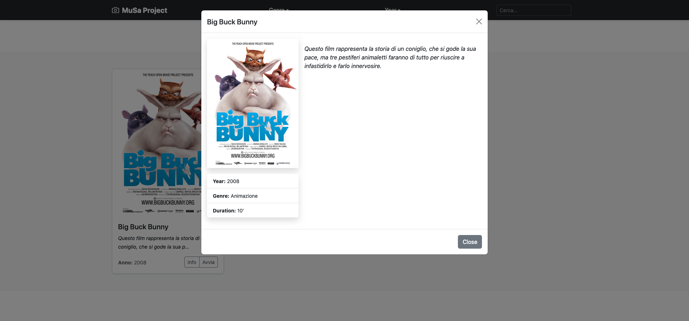
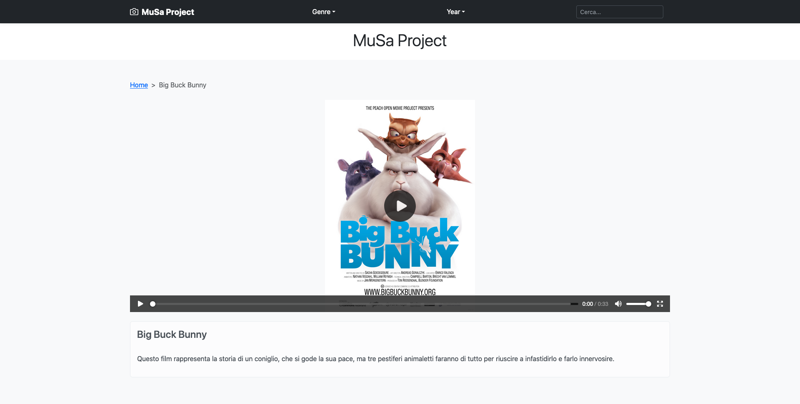
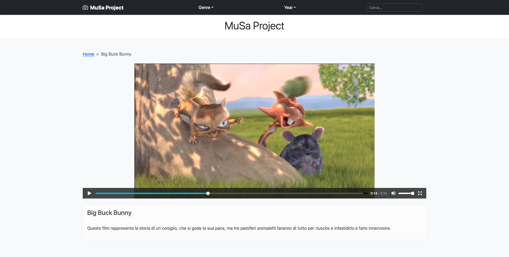
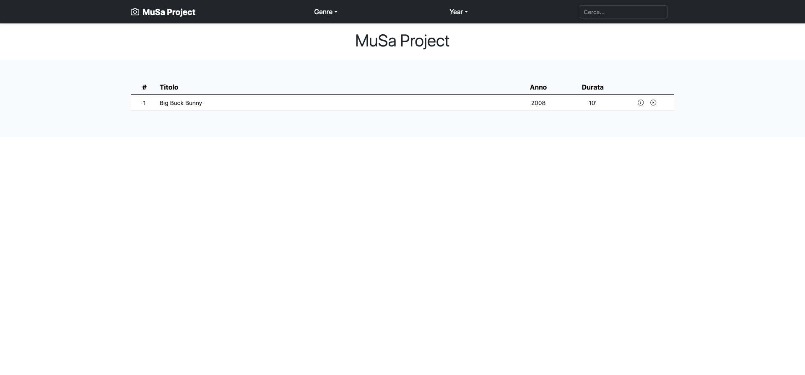

# MuSa Portable
The "portable" version currently in development and in "alpha" version, allows the MuSa Project to be used as an interpreter of the JSON archive without the use of a Web Server. It is convenient to use on devices without an internet connection.

### Features

-	**Completed**:

    - [x] Search for a video (title and description-if any) (*in testing*)
    - [x] Filter by Genre (*in testing*)
    - [x] Filter by Year (*in testing*)
    - [x] Pagination of results (*in testing*)

-	**Upcoming**:

    - [ ] Language customization for texts (*in development*)
    - [ ] Two different views (*in development*)
    - [ ] Different template
    - [ ] Integration and playback of audio files

### Preview

With the first version currently available you will get what can be seen in the screenshots available below.
With each advancement, the screenshots will be updated to reflect the new features included.

An online demo of the Project can be [viewed and tested](https://www.hackworld.it/demo/musa/).

|  |  |
| :---: | :---: |
| Default Home view | Default information display |

|  |  |
| :---: | :---: |
| Video player and information sheet | Video playback |

|  |
| :---: |
| Table Home view |

### Support

If you are interested in the Project and would like to support me, you could contribute to its development, with new ideas, advice or a tiny donation.

If you spot a bug, please submit a [detailed issue](https://github.com/A35G/MuSa-Portable/issues/new?assignees=&labels=bug%2Cunconfirmed&template=bug_report.yml).

Even a simple interest, is always welcome :wink:

### Thanks to:

- [Elusoji sodeeq](https://github.com/sdkcodes) - For his article in [LogRocket](https://blog.logrocket.com/how-to-create-a-framework-agnostic-javascript-plugin/).
- [Yossi Abramov](https://yossiabramov.com/) - For Vanilla JS Infinite Scroll example on [Codepen](https://codepen.io/yossi_abramov/pen/WNxzzEq)
