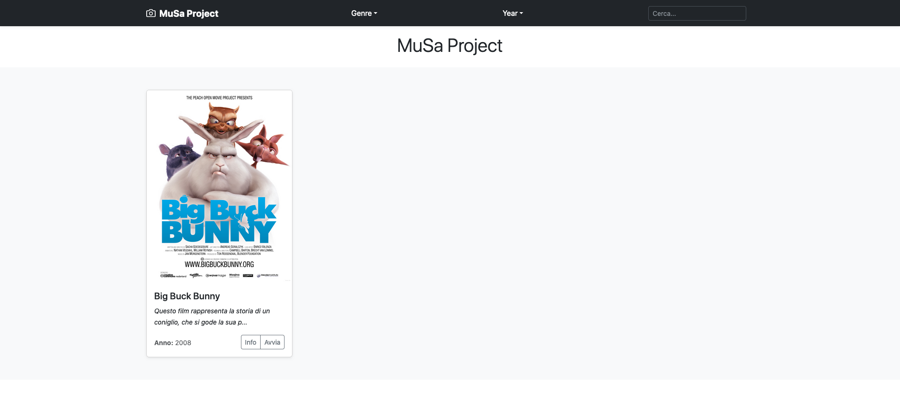

# MuSa Portable
The "portable" version currently in development and in "alpha" version, allows the MuSa Project to be used as an interpreter of the JSON archive without the use of a Web Server. It is convenient to use on devices without an internet connection.

# Features

-	**Completed**:

    - [x] Search for a video (title and description-if any) (*in testing*)
    - [x] Filter by Genre (*in testing*)
    - [x] Filter by Year (*in testing*)

-	**Upcoming**:

    - [ ] Language customization for texts
    - [ ] Pagination of results (*in development*)
    - [ ] Two different views (*in development*)
    - [ ] Different template
    - [ ] Integration and playback of audio files

# Preview

With the first version currently available you will get what can be seen in the screenshots available below.
With each advancement, the screenshots will be updated to reflect the new features included.

|  |  |
| :---: | :---: |
| Default Home view | Default information display |

|  |  |
| :---: | :---: |
| Video player and information sheet | Video playback |

|  |
| :---: |
| Table Home view |
